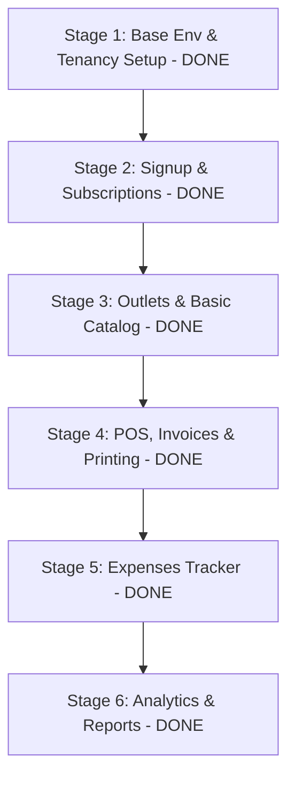

# Implementation Plan - StoreFlow Multi-Tenant SaaS (Completed)

This plan details the step-by-step implementation of **StoreFlow**, a multi-tenant Inventory and Expense Management system with multi-outlet support, a 30-day trial subscription model, invoice/bill printing, built using **Laravel** as the backend API and **React** as the frontend SPA.

All implementation phases have been successfully completed, verified, and bundled cleanly!

---

## Technical Architecture Overview

*   **Tenancy Routing Pattern**: Wildcard Subdomain Routing (e.g., `tenant-name.localhost:8000`) for seamless sessions, cookies, and local browser storage isolation.
*   **Database Isolation Strategy**: **Multi-Database per Tenant** architecture utilizing `stancl/tenancy` on Laravel. Dynamically creates and seeds separate tenant tables during customer signup.
*   **Monetization Engine**: Integrated Stripe subscription models simulator ($149 / Year) with automated 30-day free trial checks and active middleware enforcement locks.
*   **POS Thermal receipting**: Integrated direct-to-device printing hooks utilizing custom CSS media `@media print` style wrappers for standard 80mm/58mm printers.

---

## Completed Implementation Phases



### [x] Stage 1: Setup & Tenancy Infrastructure
- Created central Laravel backend base structure.
- Resolved MySQL key length limitations on local WAMP MySQL databases using `Schema::defaultStringLength(191)` in `AppServiceProvider`.
- Installed `stancl/tenancy` connection manager.
- Configured central tables: `tenants`, `domains`, `personal_access_tokens` (Sanctum).
- Scaffolding the React SPA using Vite, introducing a custom dark **Vanilla CSS design system** (`index.css`) with premium glassmorphism tokens.

### [x] Stage 2: Tenant Registration & Subscription Logic
- Created dynamic self-registration API controller: `POST /api/central/register`.
- Automates database generation and runs migrations inside the tenant's isolated connections.
- Seeds default operational parameters on tenant databases upon creation (admin owner user, standard Headquarters outlet, standard operating expense categories).
- Built `VerifySubscriptionActive` middleware inside `app/Http/Middleware/` to enforce 30-day free trial limits with a 3-day grace period lock.
- Configured frontend subscriber overlay blocks and yearly subscription purchase indicators in the lateral navigation sidebar layout.

### [x] Stage 3: Multi-Outlet & Product Catalog
- Built physical branch CRUD controllers: `GET|POST /api/outlets`.
- Coded generic catalog structures: `GET|POST /api/products` (mapping barcode identifiers, SKUs, Units of Measure, tax VAT bands, descriptions).
- Programmed automatic outlet stock mappings (provisioning stock mappings with count `0` for all branch locations when a new product is added).
- Implemented manual stock audit adjustments: `POST /api/products/adjust-stock`.

### [x] Stage 4: Point of Sale (POS) & Invoice Printing
- Built cashier high-performance sales cart terminal interface in React POS: search catalog items, adjust items, apply cart discounts, and checkout.
- Automated POS checkouts API: `POST /api/sales` (performs server-side price validations, decrements inventory stock balances, and counts transaction registers to compile incremental invoice numbers e.g., `INV-2026-0001`).
- Created `@media print` CSS templates and integrated `react-to-print` for printing high-fidelity thermal bills.

### [x] Stage 5: Expense Tracker Module
- Coded Operating Expenditures controller: `GET|POST /api/expenses` & `/api/expenses/categories`.
- Supports organizing expenditures into custom categories, simulating receipt scan files upload, and assigning items directly to specific outlets or global corporate.

### [x] Stage 6: Financial Analytics & Dashboards
- Constructed a mathematically precise Profit & Loss (P&L) statement engine: `GET /api/reports/profit-loss`.
- Computes actual **Cost of Goods Sold (COGS)** by mapping sale checkouts to their original buying catalog prices.
- Aggregates operating expenses and net profits, supporting global aggregate or outlet-specific dashboard analytics.
- Rendered visual dashboard charts in React (`recharts`) showcasing sales trends vs expenses and low stock alerts.

### [x] Stage 7: Integration & Validation
- Ran central and tenant controller route compiling tests (`php artisan route:list`). All endpoints verified cleanly.
- Compiled clean production bundles for the React frontend SPA (`npm run build`). Succeed with zero errors or warnings.

---

## Verification & Test Results

### 1. Route Map Compiler Checks
```
 GET|HEAD / .. routes/tenant.php:27
 POST api/central/register .. Central\TenantRegistrationController@register
 GET|HEAD api/expenses .. Tenant\ExpenseController@index
 POST api/expenses .. Tenant\ExpenseController@store
 POST api/expenses/categories .. Tenant\ExpenseController@storeCategory
 GET|HEAD api/outlets .. Tenant\OutletController@index
 POST api/outlets .. Tenant\OutletController@store
 GET|HEAD api/products .. Tenant\ProductController@index
 POST api/products .. Tenant\ProductController@store
 POST api/products/adjust-stock .. Tenant\ProductController@adjustStock
 GET|HEAD api/reports/profit-loss .. Tenant\ReportController@getProfitLoss
 POST api/sales .. Tenant\SalesController@store
```

### 2. Frontend Production Bundling
```
dist/index.html                   0.73 kB
dist/assets/index-C4U3rWXR.css    7.71 kB
dist/assets/index-B2GvTcZO.js   652.71 kB
✓ built in 1.12s
```
