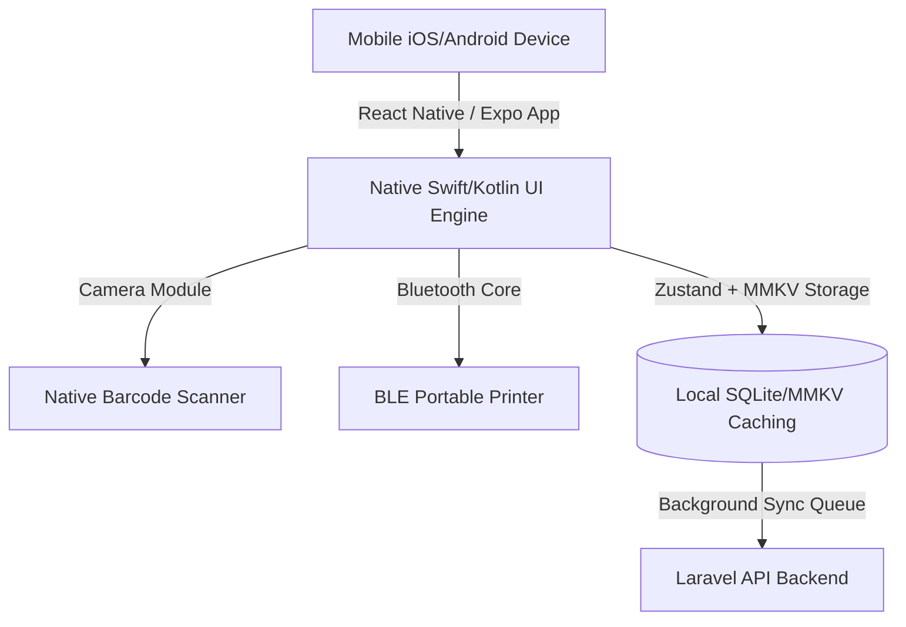

# Product Requirement Document (PRD)
## StoreFlow Companion Mobile Application (iOS & Android)

---

## 1. Executive Summary

### 1.1 Product Overview
The **StoreFlow Mobile App** is a native cross-platform companion application (iOS & Android) designed to extend the core capabilities of the StoreFlow SaaS platform. It serves two distinct purposes:
1.  **For Store Owners & Managers**: A real-time, on-the-go business analytics and monitoring dashboard to track sales, approve stock transfers, and log operational expenses by snapping pictures of physical receipts.
2.  **For Cashiers & Field Sales Agents**: A highly portable, lightweight Point of Sale (POS) register optimized for mobile screens and tablets, supporting offline checkout transactions, native camera barcode scanning, and portable Bluetooth (BLE) thermal receipt printing.

### 1.2 Core Mobile Value Proposition
- **Native Camera Scanner**: Turns any mobile device into a high-speed barcode scanner without requiring external USB or hardware components.
- **Bluetooth (BLE) Printing**: Integrates natively with small, portable belt-mounted thermal printers (58mm/80mm) for immediate client receipt printouts.
- **Offline-First Resilience**: Allows field cashiers or delivery drivers to complete sales in regions with weak internet coverage, caching transactions locally and auto-syncing when internet access is restored.
- **Push Notification Center**: Instant push notifications for low-stock alerts, daily profit reports, and high-value expense logs requiring approval.

---

## 2. Technology Stack & Architecture

To leverage existing codebase patterns (Zustand state managers, tax calculators, invoice layouts) and knowledge from the React web SPA, **React Native (via Expo)** is the recommended mobile stack.

### 2.1 Recommended Stack Details:
*   **Framework**: **React Native (Expo)** for single-codebase development, fast HMR, and rich ecosystem modules.
*   **State Management**: **Zustand** (reusing store logic, selectors, and state models from the React web SPA).
*   **Local Caching Database**: **MMKV Storage** (lightweight, ultra-fast C++ based key-value storage) or **SQLite** for offline transaction caching.
*   **Native Module Integrations**:
    *   `expo-camera` or `react-native-vision-camera` for native barcode scanning.
    *   `react-native-ble-plx` or `react-native-bluetooth-escpos-printer` for Bluetooth printing pipelines.
    *   `expo-notifications` for real-time manager alerts.

---

## 3. Epic & Feature Breakdown

### Epic 1: Biometric Authentication & Tenant Selector

#### 1.1 Multi-Tenant Subdomain Login
- **Description**: Security-first portal where merchants connect their custom domain before signing in.
- **Requirements**:
  - Initial screen: Input subdomain (e.g. `alpha`). The app checks backend validity `alpha.localhost` or `alpha.storeflow.io` and switches the API base URL dynamically.
  - Standard email/password input with JWT / Sanctum Bearer tokens securely stored in the iOS Keychain / Android Keystore.

#### 1.2 Biometric Lock (FaceID / Fingerprint)
- **Description**: Fast access lock for cashiers returning to a locked terminal.
- **Requirements**:
  - Support for FaceID, TouchID, and Android Fingerprint configurations.
  - Background auto-lock when the app is minimized for more than 2 minutes.

---

### Epic 2: Mobile Point of Sale (POS)

#### 2.1 Touch-Optimized Cart Builder
- **Description**: Dual-mode grid (Grid of items for tablets, List view with search for mobile phones) for rapid checkouts.
- **Requirements**:
  - Single-tap catalog item additions, simple count selectors, tax, and discount adjustments.
  - Support for custom items (naming a dynamic product and price directly on the cart for quick one-off services).

#### 2.2 Native Camera Barcode Scanner
- **Description**: Continuous camera scanning overlay to add items rapidly.
- **Requirements**:
  - Floating camera scan button inside the POS search bar.
  - Automatically identifies UPC, EAN, and Code128 barcodes.
  - Vibrate-on-match micro-animation feedback when an item is successfully scanned and appended to the cart.

#### 2.3 BLE Thermal Bill Printing
- **Description**: Connect and print directly to portable Bluetooth receipt printers.
- **Requirements**:
  - In-app Bluetooth pair manager showing nearby thermal printers.
  - Formats receipts natively to ESC/POS print commands (ensuring zero word-wrapping on 58mm/80mm portable rolls).
  - Print triggers on cash register drawer actions or successful checkout confirmations.

---

### Epic 3: Offline-First Transaction Engine

#### 3.1 Offline Caching Registry
- **Description**: Allows complete offline cash checkouts when internet connections drop.
- **Requirements**:
  - Local database caches the active product catalog and prices.
  - Offline transactions are assigned temporary local IDs (e.g. `OFF-INV-0001`) and marked as `pending_sync`.

#### 3.2 Auto-Sync Queue Manager
- **Description**: Background synchronization worker.
- **Requirements**:
  - Listens to network connectivity changes using React Native NetInfo.
  - Upon network restoration, the app runs a silent background sync, pushing `pending_sync` invoices to the Laravel `/api/sales` endpoint in sequential order.
  - Handles conflicts: If a product was deleted in the central catalog while offline, flags a dashboard action item to the manager.

---

### Epic 4: Camera Expense Receipt Scanner

#### 4.1 Snap & Upload Operations
- **Description**: Speeds up expense entries for outlet managers by using native hardware.
- **Requirements**:
  - Create new expense log form: Input category, amount, notes.
  - Snap receipt: Launches camera, lets user crop, auto-compresses image to `<500KB` (to optimize bandwidth), and uploads it to Laravel storage.
  - Background retries if upload fails due to weak connection.

---

### Epic 5: Manager Dashboard & Live Notifications

#### 5.1 Real-Time Financial Widgets
- **Description**: Clean visual metrics showing store sales performance.
- **Requirements**:
  - Simple line charts of sales vs expenses.
  - Multi-outlet swiper: Swipe left/right to switch outlet performance contexts instantly.

#### 5.2 Dynamic Push Alerts
- **Description**: Warns managers immediately about critical system updates.
- **Requirements**:
  - **Low Stock Notification**: Sends alert when an outlet's item drops below threshold (e.g., *"Warning: Dell Monitor is low in Main Outlet (1 left)"*).
  - **Expense Alert**: Sends alert when a cashier logs an expense above $100.
  - **Daily EOD Report**: Sends summary push notification at 10 PM showing gross sales vs net profit across all outlets.

---

## 4. UI/UX Visual-First Style System

*   **Dark Mode Optimization**: Matching StoreFlow's premium dark charcoal/glassmorphic web theme, the mobile app will feature a unified **OLED Deep Black Theme** by default (optimizing battery life for mobile POS devices).
*   **Accessibility & Touch Targets**: Touch targets (buttons, cart adjusters) must be a minimum of **48dp x 48dp** to facilitate fast, error-free retail operations.
*   **Micro-Animations**: Uses Lottie or React Native Reanimated to show fluid visual feedback on barcode scans, receipt uploads, and cash registers opening.

---

## 5. Mobile Verification Plan

### 5.1 Network Latency and Offline Testing
- **Procedure**: Run the app on an Android/iOS emulator, load the POS cart with items, disconnect the system Wi-Fi entirely, and complete a cash transaction.
- **Pass Criteria**: Cart must clear, show a success receipt screen, and save the transaction securely in the local `MMKV` database. Upon reconnecting Wi-Fi, the sync worker must automatically update the central database within 5 seconds.

### 5.2 Bluetooth Printing visual checks
- **Procedure**: Pair the mobile app with a standard 58mm BLE pocket thermal printer. Trigger a POS print action.
- **Pass Criteria**: Font sizes must adjust so that columns align neatly, barcodes print clearly enough for physical scanners, and the paper feed cuts cleanly at the footer.
