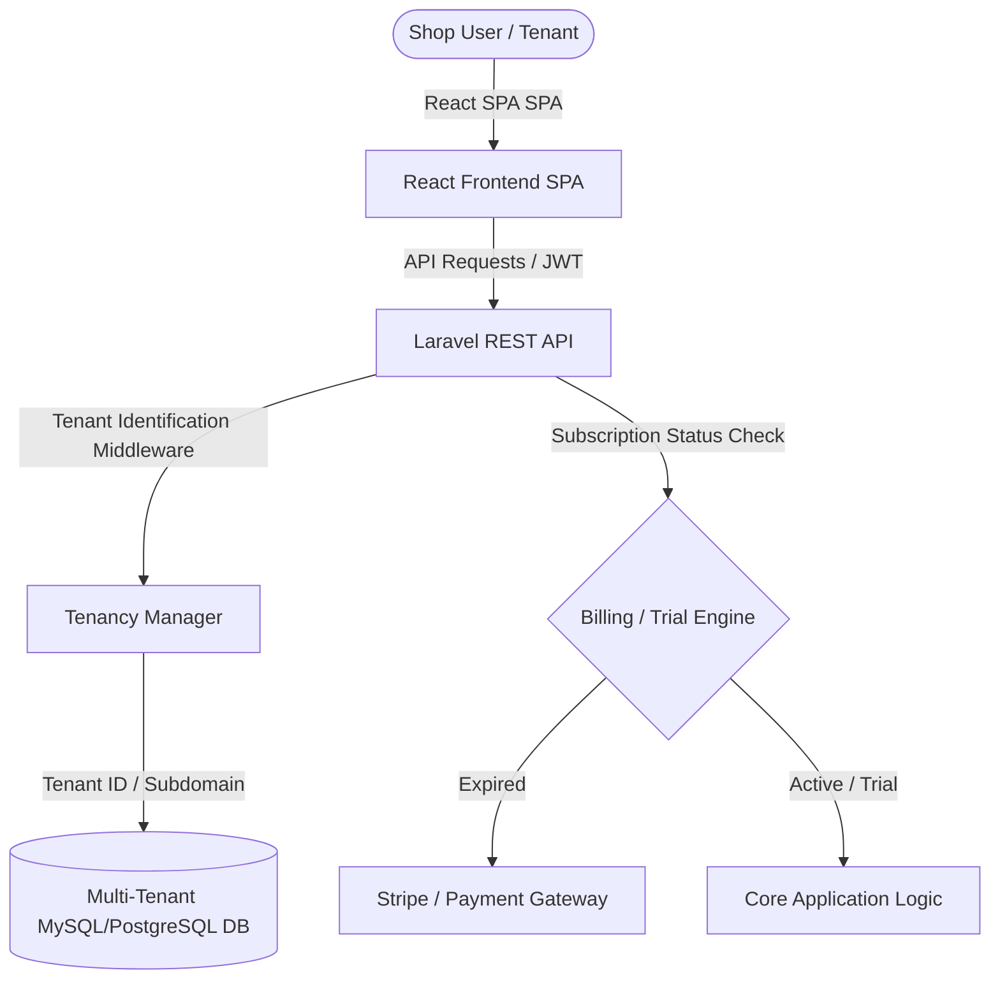
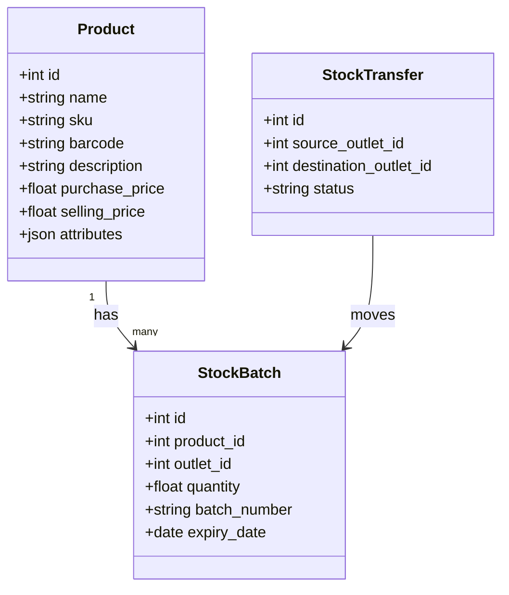

# Product Requirement Document (PRD)
## Multi-Tenant Inventory & Expense Management System (SaaS)

---

## 1. Executive Summary

### 1.1 Product Overview
The **Universal Inventory & Expense Management System** (tentatively named **StoreFlow**) is a modern, premium, multi-tenant Software-as-a-Service (SaaS) platform designed for small-to-large retail shops, wholesalers, supermarkets, and service providers. The system empowers merchants to seamlessly track their physical inventory, manage business expenses, handle multi-outlet operations, generate customized professional invoices, and print bills in various formats (including standard A4 and local thermal receipts).

### 1.2 Core Business Value
- **Multi-Tenant Architecture**: A scalable SaaS model where independent store owners sign up, get isolated databases (or isolated schema partitions), and manage their business settings independently.
- **Multi-Outlet Capability**: A single tenant can configure and track multiple physical/virtual outlets, warehouses, or stores with centralized inventory control and outlet-specific reporting.
- **Subscription Monetization**: A yearly subscription model, initiated with a **1-month (30-day) free trial** upon signup.
- **Genericity & Customization**: Modifiable parameters for units of measure (UoM), custom tax fields (VAT/GST/Sales Tax), custom payment options, and multi-currency formatting, ensuring suitability for global shop owners.

---

## 2. Target Audience & Personas

| Persona | Role | Key Needs | Pain Points |
| :--- | :--- | :--- | :--- |
| **Store Owner (Tenant Admin)** | Business Owner | Strategic overview of all outlets, profit & loss analysis, billing, employee roles. | Disconnected data across outlets, hidden expenses, high software costs. |
| **Outlet Manager** | Operational Lead | Stock levels, inventory transfers, daily outlet-specific expenses, vendor replenishment. | Stockouts, manual count errors, delayed communication with central office. |
| **Cashier / POS Operator** | Frontline User | Rapid billing, barcode scanning, generating receipts, thermal printing. | Slow UI lagging during peak hours, complex refund flows, printing failures. |
| **Accountant** | Financial Auditor | Tax compliance, expense auditing, P&L reporting, exporting transaction journals. | Incomplete expense trails, messy invoice lists, lack of reconciliation. |

---

## 3. High-Level System Architecture

The platform utilizes a modern decoupled stack:
- **Backend**: **Laravel (v11+)** acts as a robust, secure RESTful API Gateway.
  - Multi-tenancy will be managed via a reliable database-separation or single-database tenant isolation package (e.g., `archtechx/tenancy` or `spatie/laravel-multitenancy`).
- **Frontend**: **React (v18+)** configured with a highly responsive, modern, visual-first UI built with React Router, Context API / Redux Toolkit, and Tailwind CSS (or premium custom CSS components with dark-mode glassmorphism).

---

## 4. Epic & Feature Breakdown

### Epic 1: Multi-Tenancy, Onboarding, & Subscription Engine

#### 1.1 Tenant Self-Registration
- **Description**: Shop owners can sign up via a landing page.
- **Requirements**:
  - Store Name, Owner Name, Email, Password, Phone Number, Base Currency, and Base Tax setup.
  - Automatic subdomain mapping (e.g., `brandname.storeflow.io`) or path-based tenant mapping (e.g., `storeflow.io/brandname`).
  - Account activation verification email.

#### 1.2 Subscription & Billing Engine
- **Description**: Yearly subscription engine with automated trial monitoring.
- **Requirements**:
  - **1-Month Free Trial**: On registration, the tenant is marked on `trial` status for exactly 30 days. No credit card is required upfront to increase conversion.
  - **Yearly Subscription Plan**: At the end of the 30-day trial, the system enters a 3-day grace period. Access to core features (POS, Stock Adjustments, Expense additions) is locked, displaying a beautiful, non-intrusive payment screen.
  - **Payment Gateways**: Stripe / PayPal integration supporting recurring annual invoicing.
  - **In-App Invoices**: Tenant admins can download system invoices for subscription payments.

---

### Epic 2: Multi-Outlet (Multi-Location) Architecture

#### 2.1 Outlet Configuration
- **Description**: Tenant admins can register multiple locations, branch stores, or warehouses.
- **Requirements**:
  - Fields: Outlet Name, Address, Phone, Specific Tax Registration Number (if separate), Outlet Type (Retail Store, Warehouse, Online-only).
  - Central Dashboard showing aggregate metrics, with dropdown filtering for outlet-specific views.

#### 2.2 Role-Based Access Control (RBAC) per Location
- **Description**: Restrict users to specific outlets.
- **Requirements**:
  - A cashier can only log into their assigned outlet's POS terminal.
  - Outlet Managers can view stocks and run operations only for their assigned outlet.
  - Tenant Admins retain global access.

---

### Epic 3: Generic Inventory Management System

To remain highly customizable for all business types (clothing, groceries, electronics, pharmaceutical, etc.), the inventory system must support generic structures.

#### 3.1 Advanced Product Catalog
- **Description**: Standardized list of products with custom variations.
- **Requirements**:
  - **Dynamic Attributes**: Support for custom variants (size, color, weight, batch numbers).
  - **Barcoding**: SKU auto-generation and manual barcode input. Scanner-friendly UI search input field.
  - **Multi-Unit of Measure (UoM)**: Support generic measures (pcs, kg, liters, boxes, meters) with conversion factors.
  - **Tax Configurations**: Custom tax rates (exempt, 5%, 13%, 18%) toggleable per product.

#### 3.2 Dynamic Stock Tracking & Operations
- **Description**: Accurate inventory logs for inflows, outflows, and adjustments.
- **Requirements**:
  - **Real-Time Stock Balances**: Live count per product per outlet.
  - **Stock Adjustment**: Log inventory audits for discrepancies (damaged goods, theft, count corrections) with reason codes.
  - **Stock Transfer**: Order and process shipments between outlets (Request -> Ship -> Receive flow).
  - **Low Stock Threshold Alerts**: Set minimum quantities per outlet and trigger dashboard notifications.

#### 3.3 Supplier Management & Purchase Orders (PO)
- **Description**: System to buy products and automatically replenish stock levels.
- **Requirements**:
  - Supplier Profiles (Name, outstanding balance, terms of payment).
  - Purchase Order creator: Select products, enter supplier cost prices, and receive stock. Upon receipt, inventory balances increase automatically, and an account payable or expense log is generated.

---

### Epic 4: Sales, Invoicing & Printing (POS)

#### 4.1 Point of Sale (POS) Interface
- **Description**: A lightning-fast React POS layout for quick retail checkout.
- **Requirements**:
  - Responsive visual grid of products + barcode scanning input.
  - Cart features: Hold/Resume cart, apply flat or percentage discount, tax calculation.
  - Multi-mode checkout: Cash, Card, Mobile wallets, Split Payment, Store Credit.

#### 4.2 Invoice Generation
- **Description**: Legally compliant, beautiful invoice PDF generation and screen rendering.
- **Requirements**:
  - Custom brand colors, uploadable company logo, customizable header/footer notes.
  - Dynamic invoice numbering configurations (e.g., `INV-{YEAR}-{SEQUENTIAL_NO}`).
  - Dynamic payment terms (Due on receipt, Net 15, Net 30).

#### 4.3 Multiformat Bill Printing (Thermal & Standard)
- **Description**: Seamless printing capabilities direct from browser/terminal.
- **Requirements**:
  - **Thermal Receipt (58mm / 80mm)**: Tailored CSS style sheet using media queries `@media print` ensuring zero clipping, compact lines, barcode rendering, and optimal font scaling.
  - **Standard A4/A5 Invoices**: Professional layouts for corporate clients.
  - **Silent Printing / Direct Printing support**: Integration hooks for POS printing bridges if clients choose direct-to-device configurations.

---

### Epic 5: Expense Tracker

#### 5.1 Dynamic Expense Categorization
- **Description**: Simple logging of non-inventory expenses.
- **Requirements**:
  - Custom Expense Categories (e.g., Rent, Salaries, Electricity, Marketing, Shipping).
  - Set recurring monthly/annual expenses (e.g., store rent) that automatically trigger expense entries.

#### 5.2 Expense Receipt Capture
- **Description**: Ability to upload receipts for auditing purposes.
- **Requirements**:
  - Support for JPEG, PNG, and PDF files.
  - Attachments stored in Amazon S3 or secure local disk with secure tenant-locked links.

#### 5.3 Outlet Allocation
- **Description**: Every expense must be assigned to either "Global/Corporate" or a specific "Outlet" to calculate accurate localized profit metrics.

---

### Epic 6: Analytics, Reporting & Dashboards

#### 6.1 Real-Time Dashboards
- **Description**: High-fidelity visualization dashboard containing critical financial KPIs.
- **Requirements**:
  - Metrics: Gross Profit, Net Revenue, Total Expenses, Active Active Outstanding Receivables, and Low Stock Alerts.
  - Beautiful visual charts (Line chart of daily sales vs. expenses, Bar charts of top-selling products).

#### 6.2 Key Report Suites (Exportable to PDF / Excel)
- **Profit & Loss (P&L)**: `Revenue - Cost of Goods Sold (COGS) - Expenses = Net Profit`.
- **Inventory Valuation**: FIFO (First-In, First-Out) or Weighted Average Cost calculations.
- **Sales Report**: Breakdowns by Outlet, Payment Mode, Employee, or Category.
- **Tax Reports**: Export lists of collected taxes and paid input taxes for quick filing.

---

## 5. Technical Implementation Details & Database Design

### 5.1 Multi-Tenancy Strategy (Single DB vs Multi-DB)
For a SaaS of this nature, a **Single Database with tenant_id isolation** is recommended for rapid development, cost efficiency, and ease of deployment. However, a **Multi-Database approach** (separate database per tenant) provides supreme security, tenant-wise backups, and zero data leakage risk.

> [!TIP]
> **Recommended Decision**: Utilize **Multi-Database Isolation** via the `stancl/tenancy` package for Laravel. It maintains a central system database for tenants and subscription records, and spins up dedicated MySQL/PostgreSQL databases dynamically on tenant signup, giving enterprise-level security.

### 5.2 Key Database Schema Draft (Central & Tenant Dbs)

#### Central Database Tables:
1. `tenants`: `id` (uuid), `name`, `subdomain`, `created_at`.
2. `domains`: `id`, `tenant_uuid`, `domain` (e.g., `shop1.storeflow.io`).
3. `subscriptions`: `id`, `tenant_uuid`, `status` (trial, active, expired, grace), `trial_ends_at`, `expires_at`, `stripe_id`.

#### Tenant Database Tables (Dynamic):
1. `outlets`: `id`, `name`, `address`, `phone`, `is_active`.
2. `users`: `id`, `name`, `email`, `password`, `role` (owner, manager, cashier), `outlet_id` (nullable).
3. `products`: `id`, `name`, `sku`, `barcode`, `purchase_price`, `selling_price`, `tax_percentage`, `uom`.
4. `inventories`: `id`, `product_id`, `outlet_id`, `quantity` (decimal), `low_stock_threshold`.
5. `expenses`: `id`, `outlet_id` (nullable), `category_id`, `amount`, `expense_date`, `receipt_path`, `notes`.
6. `sales`: `id`, `invoice_number`, `outlet_id`, `cashier_id`, `subtotal`, `discount`, `tax_amount`, `total`, `payment_method`.
7. `sale_items`: `id`, `sale_id`, `product_id`, `quantity`, `price`, `tax_amount`.

---

## 6. Frontend Framework Setup & Design System

A premium design is essential for merchant satisfaction. The interface must use a **Sleek Charcoal/Dark Mode Theme** by default or as a high-fidelity toggle, with premium typography like **Inter** or **Outfit**.

### 6.1 React Design System Structure
- **Design Paradigm**: Clean, responsive layout with glassmorphic cards, micro-animations on interactive states, and strong accessibility standards.
- **Component Strategy**:
  - `Layout`: Custom Sidebar, collapsible for tablet screens, with outlet selector prominently featured at the top.
  - `POS Interface`: Highly optimized virtual list to render hundreds of items smoothly.
  - `Print Previews`: Embedded iframe views for accurate thermal receipt scaling.

---

## 7. Verification Plan & Test Strategy

To verify this highly critical commercial financial application before launch:

### 7.1 Backend (Laravel) Automated Tests
- **Tenancy Isolation Tests**: Ensure tenant A cannot execute queries that read/write data in Tenant B's database.
- **Trial & Subscription Grace Period Checks**: Write unit tests simulating time travel to verify restrictions apply accurately at 30 days.
- **Inventory Valuation Tests**: Assert the FIFO calculations match expected outputs when buying batches at variable price points.

### 7.2 Frontend (React) Test Suites
- **POS Performance Tests**: Render 1,000 products to verify search performance is sub-50ms.
- **Print Layout Visual Checks**: Utilize responsive viewport profiles in developer tools to check thermal margins (58mm/80mm) with simulated thermal printer output.

---

## 8. Development Roadmap

1. **Phase 1 (Week 1-2)**: Laravel Central Database System setup + Multitenancy infrastructure configuration. Landing page with tenant signup flow.
2. **Phase 2 (Week 3-4)**: Core modules development (Product Catalog, Stock management per Outlet, Expense Tracker).
3. **Phase 3 (Week 5-6)**: Advanced POS development, multi-mode payment checkouts, and standard/thermal receipt engine.
4. **Phase 4 (Week 7)**: Subscription gateway (Stripe/PayPal integration) and trial lock logic.
5. **Phase 5 (Week 8)**: Reporting engine, QA testing, P&L generation, and beta release.
